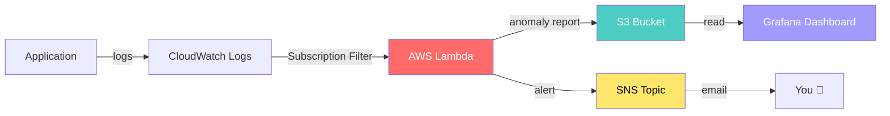

# 🔍 AI-Powered Log Anomaly Detection Pipeline

An end-to-end **log anomaly detection system** that uses an **Isolation Forest ML model** running on **AWS Lambda** to automatically detect anomalies in CloudWatch log streams, store results in S3, send alerts via SNS, and visualize everything in Grafana.

## 🏗️ Architecture



## 📁 Project Structure

```
log-anomaly-pipeline/
├── src/
│   ├── lambda_function.py      # Lambda entry point
│   ├── anomaly_model.py        # Isolation Forest train/predict
│   ├── log_parser.py           # CloudWatch event decoder + feature extraction
│   └── log_generator.py        # Synthetic log generator for testing
├── model/
│   └── isolation_forest.joblib # Trained ML model
├── tests/
│   ├── test_log_parser.py      # 7 tests
│   ├── test_anomaly_model.py   # 9 tests
│   └── test_lambda_function.py # 3 tests (mocked AWS with moto)
├── terraform/
│   ├── main.tf                 # S3, SNS, provider config
│   ├── lambda.tf               # Lambda, IAM, CloudWatch trigger
│   ├── variables.tf            # Configurable inputs
│   └── outputs.tf              # Resource identifiers
├── .github/workflows/
│   ├── ci.yml                  # Lint + Test on every push
│   └── cd.yml                  # Deploy to AWS on merge to main
├── grafana/
│   └── dashboard.json          # Pre-built Grafana dashboard
├── scripts/
│   └── train_model.py          # Model training script
├── requirements.txt            # Production dependencies
└── requirements-dev.txt        # Dev/test dependencies
```

## 🚀 Quick Start

### 1. Clone & Setup
```bash
git clone <your-repo-url>
cd log-anomaly-pipeline

# Create virtual environment
python3 -m venv venv
source venv/bin/activate  # macOS/Linux
# venv\Scripts\activate   # Windows

# Install dependencies
pip install -r requirements-dev.txt
```

### 2. Generate Sample Logs
```bash
python src/log_generator.py --count 500 --output logs/sample.jsonl
```

### 3. Train the Model
```bash
python scripts/train_model.py
```

### 4. Run Tests
```bash
python -m pytest tests/ -v --cov=src
```

### 5. Deploy to AWS (requires credentials)
```bash
cd terraform
terraform init
terraform plan -var="alert_email=you@example.com"
terraform apply
```

## 🧠 How It Works

### The ML Pipeline

1. **Log Generator** → Creates realistic JSON logs with ~5% anomalies injected
2. **Feature Extraction** → Converts logs to numeric features: `[response_time, is_error, is_warning, status_code]`
3. **Isolation Forest** → Unsupervised ML model that isolates anomalies by their unusual feature values
4. **Predictions** → Each log gets classified as normal (`1`) or anomaly (`-1`)

### The AWS Pipeline

1. **CloudWatch** receives application logs
2. **Subscription Filter** triggers Lambda on new logs
3. **Lambda** decodes events, runs ML model, detects anomalies
4. **S3** stores detailed anomaly reports (JSON)
5. **SNS** sends email alerts for immediate awareness
6. **Grafana** visualizes anomaly trends and details

## 🔧 Configuration

| Variable | Description | Default |
|----------|-------------|---------|
| `aws_region` | AWS region | `us-east-1` |
| `project_name` | Resource name prefix | `log-anomaly` |
| `environment` | Deployment env | `dev` |
| `alert_email` | SNS alert recipient | `""` |
| `lambda_timeout` | Lambda timeout (s) | `60` |
| `lambda_memory` | Lambda memory (MB) | `256` |

## 📊 Grafana Setup

1. Install Grafana: `brew install grafana` (macOS) or [download](https://grafana.com/grafana/download)
2. Start: `brew services start grafana`
3. Open `http://localhost:3000` (admin/admin)
4. Add **CloudWatch** data source with your AWS credentials
5. Import `grafana/dashboard.json` via Dashboards → Import

## 🔄 CI/CD Pipeline

| Workflow | Trigger | Steps |
|----------|---------|-------|
| **CI** | Push/PR | Checkout → Install → Lint (flake8) → Test (pytest) → Coverage |
| **CD** | Merge to main | Test → AWS Credentials → Terraform Init → Plan → Apply |

### Required GitHub Secrets
- `AWS_ACCESS_KEY_ID`
- `AWS_SECRET_ACCESS_KEY`
- `ALERT_EMAIL` (optional)

## 🧪 Test Coverage

```
22 tests across 3 test files:
  • test_log_parser.py      — CloudWatch decode, message parsing, feature extraction
  • test_anomaly_model.py   — Training, predictions, scoring, serialization
  • test_lambda_function.py — E2E with mocked AWS (moto)
```

## 📝 Technologies Used

| Technology | Purpose |
|-----------|---------|
| **Python 3.11** | Core language |
| **scikit-learn** | Isolation Forest ML model |
| **AWS Lambda** | Serverless compute |
| **CloudWatch** | Log ingestion & monitoring |
| **S3** | Anomaly result storage |
| **SNS** | Alert notifications |
| **Terraform** | Infrastructure as Code |
| **GitHub Actions** | CI/CD automation |
| **Grafana** | Visualization & dashboards |
| **moto** | AWS mocking for tests |

## 📜 License

MIT
